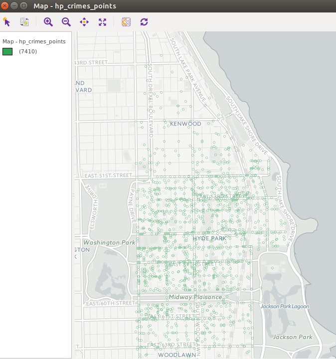
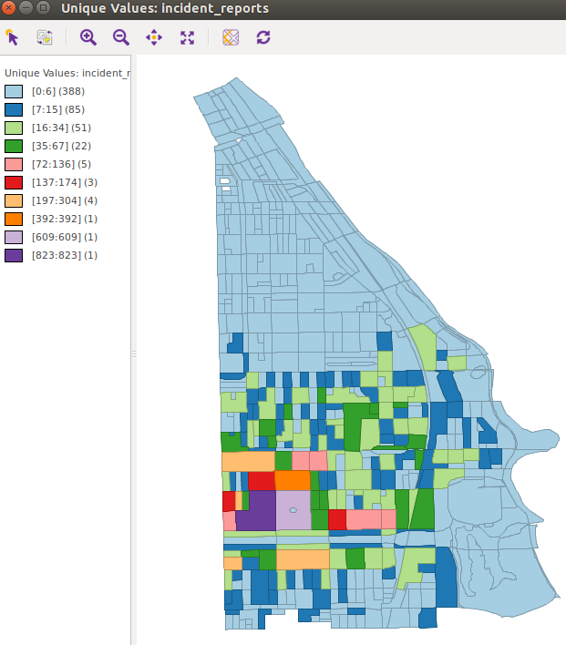
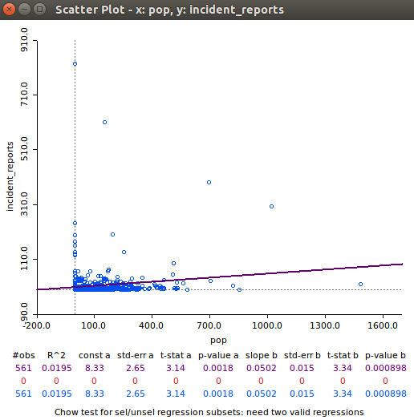
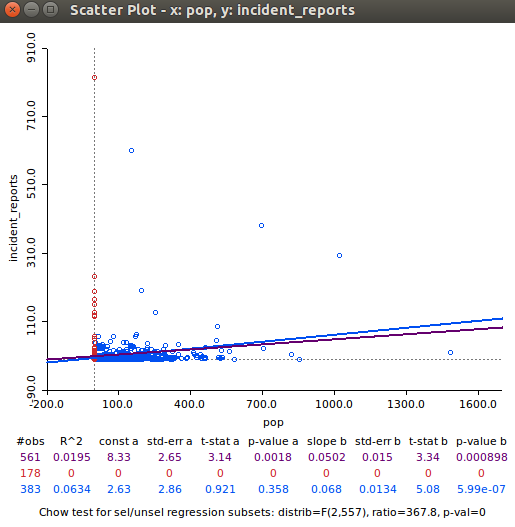
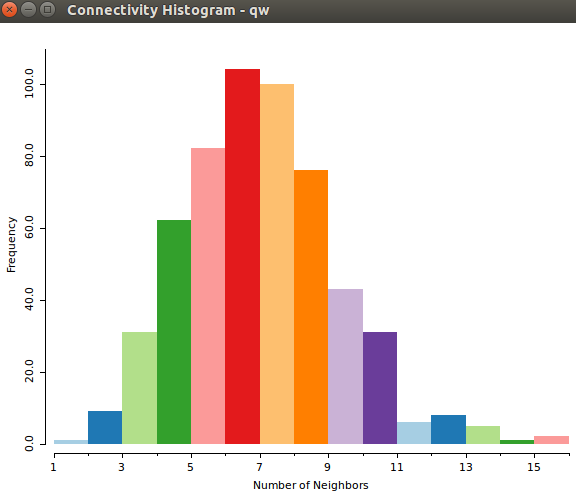
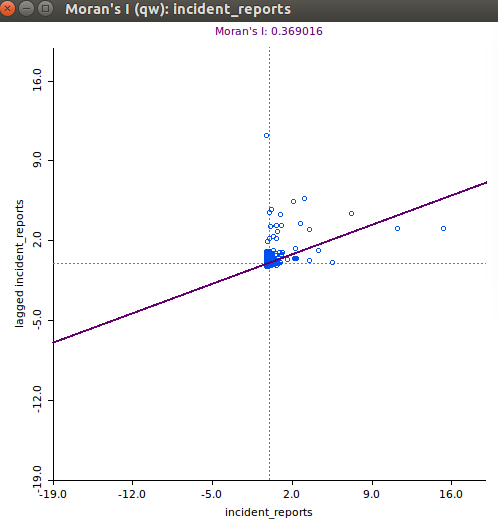
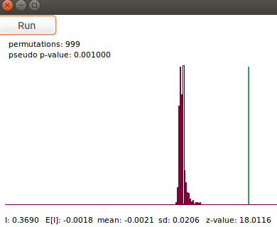
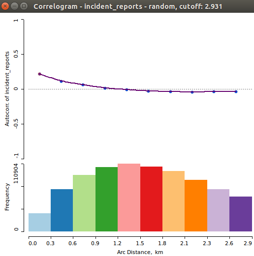
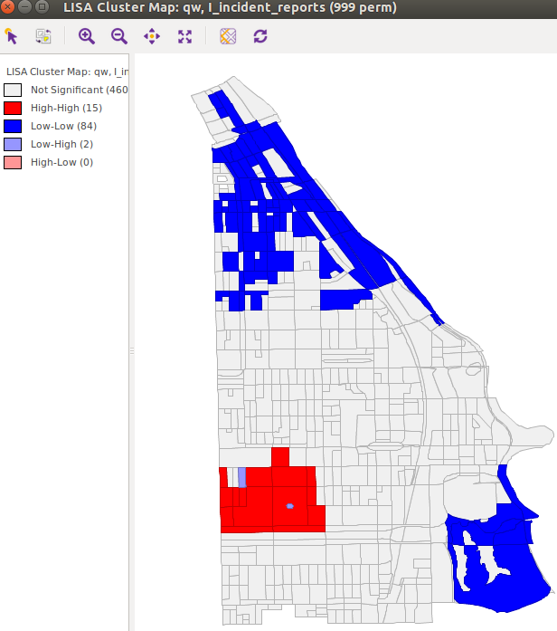
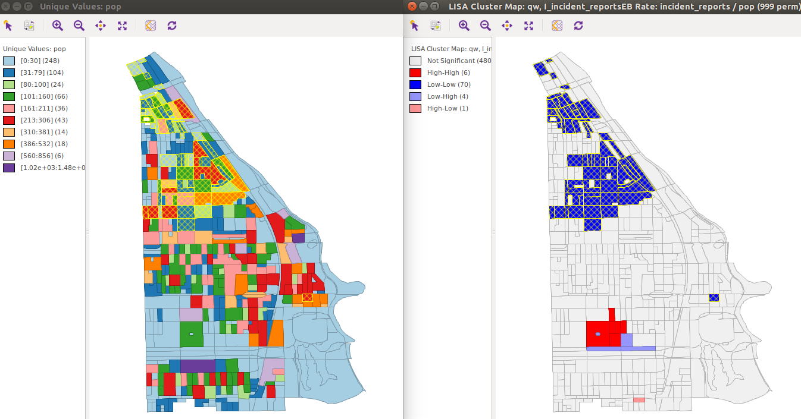

## Mapping UCPD Incident Reports in the UCPD Patrol Zone

The UCPD patrols the area between Cottage Grove Avenue (W) and Lake Shore Drive (E) as well as between 37th (N) and 64th street. Pictured below is a point map of the UCPD incident reports within the patrol zone from July 2010 to October 2016.

```{r, out.width = "400px", out.height="300px", echo=FALSE}

```

A glancing look at the map appears to show that the northern part of the UCPD patrol zone, north of 51st street especially, is sparsely populated by incident reports. The bulk of the points appear to be concentrated south of 51st street. Utilizing a unique values map, with the individual incident points assigned to individual census tracks, the distribution of incidents can be more effectively visualized.

```{r, out.width = "400px", out.height="300px", echo=FALSE}

```

The unique values map does indeed show that the highest number of incident reports are included in census tracts that are closest to campus. Note the two purple census tracks: the UChicago Hospital Complex and Main Quad respectively have the highest number of incident reports of all mapped census tracts.

## Exploratory Data Analysis

Let's try to explain the concentration in incidence reports. While it would be nice to have a plethora of variables within each census tract to choose from, the only one currently integrated is the 2010 census population. While this population data is only so useful, as the population may have changed during the 6 years of incident reporting, it is a decent starting point. To begin, let's see whether the population of a census tract is significant in the number of incident reports. Below is a scatter plot of incident reports against population.

```{r, out.width = "400px", out.height="300px", echo=FALSE}

```

With the significant p-value, this scatter plot seems to indicate that an increase of 100 people in a given census tract is associated with an increase of ~5 incident reports. However, a total of 178 census tracts, such as the UChicago Hospital complex, contain a population of zero. Excluding these 0 population census tracts, an increase of 100 people then seems to be associated with an increase of 7 incident reports, as seen below.

```{r, out.width = "400px", out.height="300px", echo=FALSE}

```

### Expansion Point: CPD Crime Data as Potential Explanatory Variable

From our initial mapping and exploration of the data, there does appear to be some relationship between incident reports and population. However, CPD Crime Data could also be correlated with UCPD incident reports. Namely, the observation of few incident reports in the Northern section of the UCPD patrol zone could simply be due to the lower student population in this area. Simply put, people not associated with UChicago might be more likely to report to the Chicago Police. By integrating CPD crime data, it could be determined that these northern areas have similar numbers of total "Incidents" (UCPD + CPD Data), since CPD incidents make up a larger proportion of the total incident count. Such a finding would show that the low number of UCPD reports in these areas is actually misleading. This data will hopefully be integrated in time for the final project.

## Global Spatial Autocorrelation

However, before an investigation of the uneven distribution of UCPD Incident reports can begin. It must be determined that such spatial autocorrelation is significant in the first place, that it is result of a non-random underlying process of some sort. To begin, we will utilize the Moran's I statistic with a permutation test to determine significance. The spatial weights utilized will be queen contiguity weights, as they appear to produce the most symmetric connectivity histogram (below).

```{r, out.width = "400px", out.height="300px", echo=FALSE}

```

Now we view a scatter plot and permutation test the Moran's I statistic.

```{r, out.width = "400px", out.height="300px", echo=FALSE}

```

```{r, out.width = "400px", out.height="300px", echo=FALSE}

```

According to the permutation test then, we have good signs that there is global spatial autocorrelation. Additionally, the value of Moran's I is positive, indicating that there is clustering of like values (high-high, low-low incident reports).

Now, utilizing a nonparametric spatial correlogram, we will attempt to identify the effective extent of this positive spatial autocorrelation.

```{r, out.width = "400px", out.height="300px", echo=FALSE}

```

Each bin contains more than the recommended 30 pairs, and according to thespatial correlogram, the mild positive autocorrelation of incident reports appears to occur up to a distance of ~1.35 kilometers.

## Cluster Detection

So according to the Moran's I statistic and permutation test, there appears to be *positive* global spatial autocorrelation. However, the local extent of spatial autocorrelation is currently unknown. Using a Univariate Local Moran's I cluster map search for clusters of high-high and low-low for incident reports, which the above Global Spatial Autocorrelation analysis has inferred to exist.

```{r, out.width = "400px", out.height="300px", echo=FALSE}

```

The above cluster map shows the presence of clusters significant at the .01 level. As we might expect from the first maps shown, there are high-high clusters of incident reports around the main UChicago Campus as well as low-low clusters in the northern areas if the map. I must also address that there are 2 high-low census tracts on the UChicago Campus, but these are likely spurious, as one of the census tracts is the circle in the middle of UChicago's main quad, and the other is an equipment storage area adjacent and north of the UChicago hospital complex.

### Rates Cluster Detection

Now we will attempt to find census clusters based on the rates of incidents over population in given census tracts. Below we see a unique values map of census tract populations and on the right we see a Local Moran's I with Empirical Bayes Rate of incident reports over population.

```{r, out.width = "400px", out.height="300px", echo=FALSE}

```

Unsurprisingly, the rates cluster map shows similar patterns to the incident reports cluster map. However, as shown in the above graphic, the clusters of low-low incident/population rate census tracts are selected and actually have fairly high population levels. Given our exploratory data analysis, we would expect, generally, that a higher census tract population might lead to more incident reports.

As mentioned earlier, a supplement of CPD crime data can help determine whether there is in fact a lower rate of incident reporting, but the fact that these northern areas have lower rates of incidents/population is another piece of evidence indicating that the UCPD Incident reports could in fact be underrepresenting the level of activity in this area.

## Closing Comments

The final project will include an analysis of not only incident reports in general, but also specific types of incident reports, including thefts, property crimes, information for a crime, and traffic related incidents. As was discovered in the making of the above descriptive statistics, it might also be useful to integrate CPD statistics in order to assess the the true level of incident activity within the UCPD patrol zone, and by extension the effectiveness of the UCPD reports themselves in conveying that activity level. However, when it comes to supplmenting specific UCPD incident report types with CPD data, the differences in incident classification might complicate the process. (The UCPD and CPD might use different words to classify similar incidents, or similar words to classify different incidents.)

On this point, note that the in the census tracts south of Midway Plaisance, although these areas are the southern fringe of the UCPD patrol zone, there is a higher concentration of incident reports in these areas as compared to the northern fringes of the zone. As mentioned earlier, this could be a result of differences in student/affiliate population. Given the closer proximity to campus, these southern fringes likely have higher concentrations of UChicago associated residents, and hence the campus police will be more involved in these areas, all else being equal.

On a technical note, the GPS coordinates of each incident report has been calculated utilizing the Google Maps API. However, a number of incident reports list multiple addresses, in most cases to indicate the starting and ending points of a route in which someone lost property, or to indicate a generl one of activity for the incident. Any incident containing multiple addresses, (a clear minority of all the incident reports scraped) has been left from the analysis, as doing spatial analysis with them is not condusive to my current strategy of integration into census tracts.


