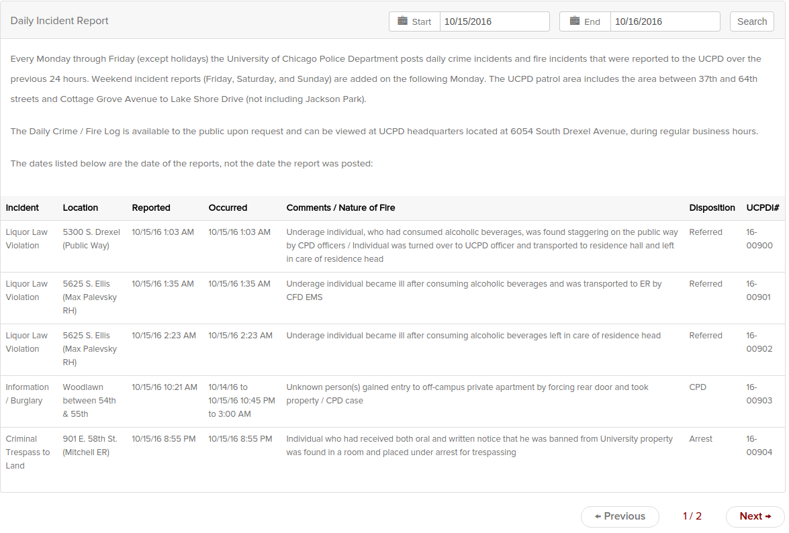

## The Data

The UCPD incident reports are [**published regularly**](https://incidentreports.uchicago.edu/incidentReportArchive.php?), and the raw form of the data is given below:

<!-- [**published regularly**](https://data.cityofchicago.org/Public-Safety/Crimes-2001-to-present/ijzp-q8t2/data), and the raw form of the data is given below: -->


```{r, out.width = "400px", out.height="300px", echo=FALSE}

```

Additionally, from the Chicago Open Data Portal I utilize the city's  [**census tract polygons**](https://data.cityofchicago.org/Facilities-Geographic-Boundaries/Boundaries-Census-Blocks-2010/mfzt-js4n/data), [**Chicago Police Department (CPD) crime statistics**](https://data.cityofchicago.org/Public-Safety/Crimes-2001-to-present/ijzp-q8t2/data), and [**2010 population by census tracts**](https://data.cityofchicago.org/Public-Safety/Crimes-2001-to-present/ijzp-q8t2/data). 

The UCPD data is scraped from the incident report website, producing a raw CSV file. Then, the addresses contained within the raw CSV are converted to GPS coordinates wherever possible using the Google Maps API. Sometimes, the UCPD filed addresses that were difficult to parse. For example, many thefts were reported as occurring someplace between two addresses, and these will be left out of the final report because they are difficult to pin down to a single location. Other times, the UCPD reported incidents outside the patrol zone (Indiana, the Gleacher Center Downtown, etc.). Once a processed CSV containing the GPS coordinates is created, the incident reports within are merged, along with CPD crime data and the 2010 population numbers, into a geojson file of the polygons of the census tracts comprising the UCPD patrol zone.

All code utilized for scraping, cleaning, coordinate lookup, and census tract lookup is available on [**Github**](https://github.com/shugamoe/macss_f16/tree/master/spatial/proj). The code provided was combined with non-automated techniques (manual removal with GeoDa). The code functionality is ad-hoc at best, but I am planning to revise it in the future to provide a more refined transition from the raw form on the UCPD website to actionable spatial data.

## UCPD Theft Reports: UChicago Campus Bias

For the UCPD data I will be evaluating the theft reports. Theft reports comprise a clear plurality of the overall UCPD data and for later comparison to CPD data, keeping the topic narrowed to theft ensures a more robust basis for comparison. An overall comparison between the UCPD and CPD data would be susceptible to one dataset or another over and/or undercompensating for certain types of crimes. For instance, the UCPD does not seem to track certain types of crimes like fraud or domestic violence, but both track thefts.

A unique values map in GeoDa of all the UCPD theft reports from 2011-2015.

```{r, out.width = "400px", out.height="300px", echo=FALSE}
knitr::include_graphics("~/Pictures/sp_theft_unique.png")
```

The unique values map shows the highest number of theft reports are included in census tracts that are closest to campus. Note the two purple census tracks: the UChicago Hospital Complex and Main Quad respectively have the highest number of theft reports of all mapped census tracts.

While a simple visual inspection of the unique values map seems to suggest a high clustering of theft reports around UChicago's main campus (census tract with small circle inside), the presence of such clusters can be more rigorously confirmed by a univariate local Moran's I cluster map with .01 significance. Note that all local spatial autocorrelation done utilizes queen weights, as the associated connectivity histogram appeared the most symmetric (see below).

```{r, out.width = "400px", out.height="300px", echo=FALSE}
knitr::include_graphics("~/Pictures/sp_ucpd_theft_cluster.png")
knitr::include_graphics("~/Pictures/sp_hist.png")
```

As one can see, the high-high clusters lie in, adjacent to, or just outside UChicago's campus. Additionally, the low-low clusters lie either in the northernmost section of the UCPD patrol zone, or in or just by Jackson Park in the southeast part of the patrol zone. Unfortunately, the bias for a high number of incidents off campus and a low number of incidents in the northernmost and southeast sections of the patrol zone seem to indicate that the UCPD reports are not a reliable of indicator of the level of crime occurring within Hyde Park.

However, with the inclusion of 2010 population data and CPD Data from 2011-2015, the bias in the UCPD incident report data can be evaluated in the most relevant available context.

## Population: Not the Cause of Campus Bias

A box map (Hinge=1.5) in GeoDa for the 2010 population of census tracts in the UCPD Patrol Zone:

```{r, out.width = "400px", out.height="300px", echo=FALSE}
knitr::include_graphics("~/Pictures/sp_pop_boxmap.png")
```

This map clearly shows that the the highest population census tracts are relatively well spread throughout Hyde Park. Looking at this map, one would be hard-pressed to claim that the high-high and low-low clusters of the UCPD incident reports are simply due to high and low populations, respectively, in the census tracts. This map suggests that the rate of UCPD reports per person is simply higher for the high-high clusters and lower for the low-low clusters. This is mostly confirmed in the univariate local moran's I with emprirical bayes smoothing map (.01 significance) of total theft reports over population:

```{r, out.width = "400px", out.height="300px", echo=FALSE}
knitr::include_graphics("~/Pictures/sp_ucpd_tpop_cluster.png")
```

Note the similarity between this rate cluster map and the UCPD incident report cluster map shown previously. The main differences occur in census tracts with zero population. For instance, the UChicago Hospital, the tract adjacent left to the UChicago main quad (tract with a small circle in it) is no longer a high-high tract and Jackson Park is no longer a low-low tract. This seems to be because the GeoDa feature ignores tracts in which the rate (due to zero population) is zero.

Of course though, the population data is anywhere from 0-4 years out of data for the data, but even when total incidents are broken down by year, the cluster maps (not shown) do not seem to indicate a change in high-high and low-low clusters of UCPD reports per person. Seeing as the UCPD is a university police department and might simply focus on crimes related to University affiliated persons, this might simply be due to the fact that the affiliate population has not experienced a significant shift in location in the years since the census was taken. Also, incident reports might be more dependent on some other variable, or factor that might make the UCPD more likely to report the incident than the CPD. 

## The CPD Theft Data

Below, left, is a univariate local moran's I cluster map (.01 significance) of thefts recorded by the CPD from 2011-2015. On the right is a 6 natural breaks map of the 2010 population.

```{r, out.width = "400px", out.height="300px", echo=FALSE}
knitr::include_graphics("~/Pictures/sp_sbs_cpdtheftpop.png")
```

Immediately one can tell that the clustering pattern is markedly different from the clustering pattern of UCPD incidents. While there does appear to be a single high-high cluster on the UChicago campus (the tract north adjacent of the main quad), the other 11 high-high clusters appear to be spread to areas more removed from UChicago's campus. The high-high clusters also appear to be located in areas with higher populations, which one might expect if the theft per person number was not spatially autocorrelated and instead relatively consistent spatially.

Is their spatial autocorrelation? Let's first check a measure of global spatial autocorrelation for the rate of CPD thefts per person: Moran's I with EB Rate.

```{r, out.width = "400px", out.height="300px", echo=FALSE}
knitr::include_graphics("~/Pictures/sp_cpdtheftrate_gsa.png")
```

Looking at the high pseudo p-value of .436, there does not appear to be global spatial autocorrelation in the amount of CPD thefts per person. While this result might be disconcerting if the scope of the data were larger, say all of Chicago, in this case, no global spatial autocorrelation might instead be expected. Indeed, the scope of the UCPD patrol zone, Hyde Park, and parts of the Kenwood and Woodlawn neighborhoods, are close enough and similar enough  to expect a spatially insensitive rate of crime per person. At the same time, given the presence of the UChicago campus, certainly a differentiating factor in the patrol zone, one might not be able to expect a lack of global spatial autocorrelation to be the "true" state of thefts in the zone. There are some incidents of thefts that are handled exclusively by the UCPD and not reported by the CPD, particularly, as has been seen, those incidents on and around the UChicago campus. 

Let's check global spatial autocorrelation with the combined UCPD and CPD thefts per person data:

```{r, out.width = "400px", out.height="300px", echo=FALSE}
knitr::include_graphics("~/Pictures/sp_alltheft_gsa.png")
```

Even with the inclusion of the UCPD theft data, the pseudo p-value is still .162, leading us to believe that there is not global spatial autocorrelation in regards to combined thefts per person from 2011-2015. Using the combined data with a local moran's I with EB rate cluster map (.01 significance), we see a huge reduction in the local clusters previously seen in separate instances of the CPD and UCPD only thefts.

```{r, out.width = "400px", out.height="300px", echo=FALSE}
knitr::include_graphics("~/Pictures/sp_alltheft_cluster.png")
```

### UCPD vs. CPD vs. UCPD + CPD

For thefts, the most common crime in the UCPD patrol zone, combining UCPD and CPD data and then looking for clusters (local spatial autocorrelation) results a new cluster map in stark contrast with the same maps separately on UCPD and CPD data. 

For many of the other types of crimes, the CPD collects much more data and hence the CPD cluster maps often more closely resemble the cluster map for the "combined" data. This is especially true for more serious crimes. Below is a progression of local moran's I with EB rate cluster maps for the UCPD, CPD, and UCPD + CPD data on robberies per person.

```{r, out.width = "500px", out.height="300px", echo=FALSE}
knitr::include_graphics("~/Pictures/sp_rob_prog.png")
```

As one can see, the 2nd (CPD) and 3rd (UCPD + CPD) cluster maps are essentially identical. 

The safest bet is of course to utilize the combined data, but generally, the CPD data is a more accurate reflection of a type of crime within the UCPD patrol zone than the UCPD data is.

### UCPD Incident Handoffs

While we have treated the UCPD and CPD data as separate entities, there is a degree of overlap between the two. The UCPD incident reports indicate whether or not the case was handed over to the CPD. Let's take a look at the cases the UCPD has handed off to the CPD for thefts (left) and robberies (right) from 2011-2015 in the two unique values maps given below.

```{r, out.width = "500px", out.height="300px", echo=FALSE}
knitr::include_graphics("~/Pictures/sp_ucpdcpd_theft.png")
knitr::include_graphics("~/Pictures/sp_ucpdcpd_robbery.png")
```

Although the UCPD reports far more thefts than robberies, it is clear that the UCPD is much more likely to handoff robbery cases than theft cases. This is not particularly surprising, as [**on the UCPD's own website**](http://safety-security.uchicago.edu/police/data_information/) it claims that the "CPD is the investigative agency for criminal incidents that occur off-campus." This statement is relatively congruous with the above maps, the handoff cases are more likely to appear off-campus rather than on. (Perhaps more "serious" cases on-campus are handed off to the CPD?) However, the UCPD appears to investigate at least some criminal incidents, as not every case is handed off to the CPD.

### Arrest Likelihood

Investigations occasionally lead to arrests (*gasp*). Both the UCPD and CPD indicate whether a report has an arrest associated with it and the proportion of arrests for total number of cases can be mapped. However, given the extremely local focus of the data, it is essential to compare the arrest likelihood map to a map of how often that crime type exists in the first place. Below are two natural breaks maps for the arrest likelihood for UCPD thefts (left) and the simple number of UCPD thefts per census tract.

```{r, out.width = "500px", out.height="300px", echo=FALSE}
knitr::include_graphics("~/Pictures/sp_ucpd_theft_arrest_chance.png")
```

Obviously there are a number of census tracts in which the arrest probability is much too high to believed:.5 or even 1.0. These are simply census tracts with low number of thefts and 1 or 2 arrests. Comparing the two maps, one can see, much to the dismay of paranoid UChicago parents everywhere, that the tracts on campus, where thefts are the highest, is actually where some of the lower arrest rates are. One can see this more clearly with a EB cluster map (.01 significance):

```{r, out.width = "500px", out.height="300px", echo=FALSE}
knitr::include_graphics("~/Pictures/sp_ucpd_theft_arrest_cluster.png")
```

In fact, the areas either on or just next to the UChicago campus are where the only low-low clusters for arrest rates are. There are a few notable exceptions. The UChicago Hospital census tract, just to the left of UChicago's main campus, is a high-low cluster, which makes sense, given the increased security presence one might expect around a hospital. 

Given the number of times the UChicago Hospital or main campus has been mentioned, the "zoning", so to speak, of a census tract would definitely be useful information to have, and could shed some light on some of the UCPD and/or CPD crime patterns. However, the census tracts only have population counts (only after a spatial merge). Instead, the census tracts bring their own host of issues.

### Census Tract Issues

Although the census tracts are for the most part conveniently shaped polygons to assign the UCPD and CPD reports to, they still bring a number of complications. To begin with, although it may appear that the census tract polygons are completely contiguous, they are not. Although ostensibly residing inside the the UCPD patrol zone, not every point could be found to reside within a census tract polygon; a fair number fell through the cracks so to speak, residing in the minuscule space between the borders of the census tracts.

Accordingly, reported crimes that fell outside (Indiana, downtown, etc.) of the UCPD patrol zone were sometimes grouped with crimes that were inside the patrol zone, but unable to fit precisely in a census tract, requiring a more manual, drag-and-select approach to select relevant reports. While not insurmountable within the scope of this project, a fully automated approach to selecting relevant reports ought to utilize north, south, and west GPS coordinate cutoffs. (Lake Michigan takes care of East.)

Additionally, there is variability in the size and shape of the census tracts. In particular, there is a not insignificant amount of oddly-shaped and small census tracts. A few examples that I could find after are given below:

```{r, out.width = "500px", out.height="300px", echo=FALSE}
knitr::include_graphics("~/Pictures/sp_small_tract.png")
knitr::include_graphics("~/Pictures/sp_smallish_tract.png")
```

```{r, out.width = "500px", out.height="300px", echo=FALSE}
knitr::include_graphics("~/Pictures/sp_circle_tract.png")
```

While it doesn't seem that any crime reports fell within the area of these oddball census tracts, their presence does provide a set of outliers for regression analysis of the census tracts. They are hard to distinguish (and thus remove from the regression) from other normal size census tracts in which the variable of interest is zero. To deal with these small oddballs, and indeed other larger census tracts that are simply sections of road or park, is to merge them with nearby census tracts. The consolidation on the number of census tracts might also help the contiguity issue described earlier. Alternatively, the UCPD patrol zone could simply be broken into a simpler grid system, though this would sacrifice the use of the 2010 population data.

## Conclusion

This project has suffered some from the concentration on a small spatial area, falling susceptible to eccentricities in census tract polygons that might not have afflicted larger units like neighborhoods. The small area also hampered the ability to conduct point pattern analysis, due to a number of point groups that all had the exact same GPS coordinates. (Not impossible to overcome, but PPA was still eschewed given the time constraints). Too much time was also spent on throwing together a pipeline to transform the raw data into something suitable for analysis.

Even so, with the UCPD reports, 2010 population data, census tracts, and CPD reports, we were able to confirm the existence of an on-campus bias for UCPD report data, see that population difference was not a likely cause, contrast how the CPD reports per person are more spatially stable, evaluate separate and combined UCPD and CPD data, visualize the crimes the UCPD hands to the CPD, and see the difficulty in looking at arrest rates on such a small scale.


