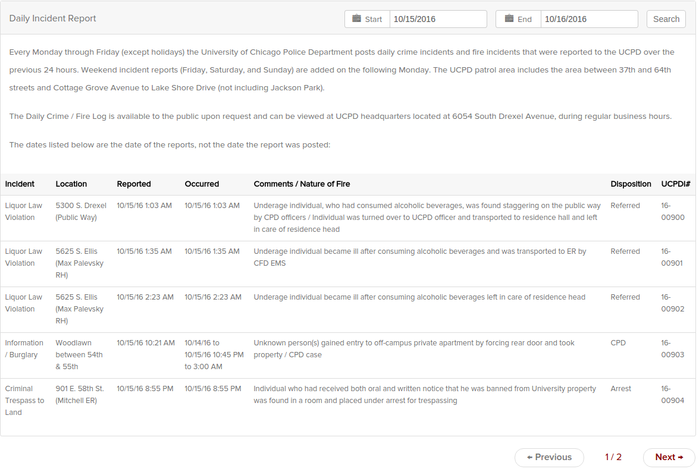

A detailed outline of the paper in bullet style, with short paragraphs describing the research question, data, data characteristics and any preliminary findings. Write-up of 2pp. max, not including any tables, graphs or maps.

## Research Question

* Initially my research question revolved around trying to identify clusters and/or spatial heterogeneity in regards to Disposition (Open, Closed, etc.) and Incident types (Theft, Assault, etc.) for the  [**incident reports published by the University of Chicago Police (UCPD) from 2011-2015**](https://incidentreports.uchicago.edu/incidentReportArchive.php?).

* However, my initial exploration of the data showed that incident reports had high-high clusters around the UChicago campus area, with low-low clusters in the northern and south-eastern areas of the patrol zone, as shown below:

```{r, out.width = "400px", out.height="300px", echo=FALSE}
knitr::include_graphics("images/cluster_ulmi.png")
```

* Looking at the above map, I had the idea to look at the Chicago Police Department (CPD) data for the relevant years to see just how much the CPD report clusters differed from the UCPD. The CPD clusters are shown below:

```{r, out.width = "400px", out.height="300px", echo=FALSE}

```

* A glancing visual comparison shows that the CPD clusters differed markedly from the UCPD clusters.

* The final report will still include an analysis of clusters and spatial heterogeneity broken down by  dispositions and incident types, but currently the integration of CPD data has been the most interesting preliminary finding.

## Data and Data Characteristics

* The UCPD incident reports are [**published regularly**](https://incidentreports.uchicago.edu/incidentReportArchive.php?), and the raw form of the data is given below:

```{r, out.width = "400px", out.height="300px", echo=FALSE}

```

* Firstly, this data had to be scraped from the incident report website, which produced a raw CSV file. Then, the addresses contained within the raw CSV had to be converted to GPS coordinates wherever possible using the Google Maps API. Sometimes, the UCPD filed addresses that were difficult to parse. For example, many thefts were reported as occurring someplace between two addresses, and these will be left out of the final report because they are difficult to pin down to a single location.

* Once a processed CSV containing the GPS coordinates was created, the incident reports within, broken down by disposition and type, were merged into a geojson file with the polygons of the approximate census tracts comprising the UCPD patrol zone. The CPD data, which was contained in CSV files that already had the GPS coordinates of the incidents was integrated into the patrol zone census tracts in an analagous manner.

* If I were able, I would have rather dealt with a dataset where I didn't have to write a ton of Python code first before being able to do any analysis. The UCPD data, when scraped, is incredibly "dirty", so to speak, and I had to slog my way through scraping, conversion to GPS, and integration into census tracts. Oh well, maybe next time.

## Preliminary Findings

* Some preliminary findings in regards to clusters have already been shown above, but generally I don't think the findings will extend much past some linear or nonparametric regression and breakdowns by different types of incidents (thefts, assaults, etc.). I wouldn't be surprised if my final report just looked like an extended version of the descriptive statistics that were given earlier.


